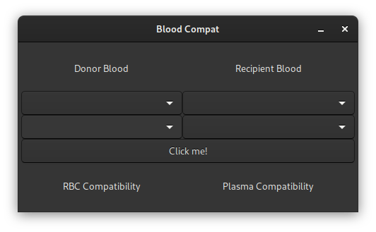
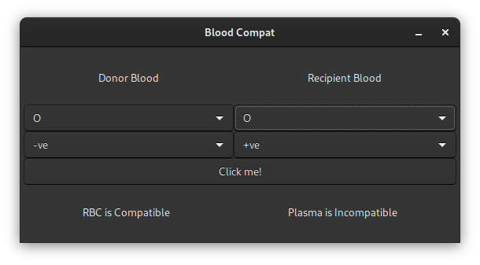

# BloodCompat

BloodCompat is a very simple blood-compatibility checker built in C# using GTK. The Project uses GTK 3.0 and .NET Core to build a GTK Application.

It just has one class, that of `Blood`, GTK-specific architecture is built into the `MainWindow` and `Program` classes.

## Building

You only need `dotnet-core-sdk` and `gtk+-3.0` Development Libraries installed.

Open a terminal/powershell window on the directory and run the following command

`dotnet run`

## Screenshots (GTK 3.0, Adwaita Theme on Fedora 32)

## Contributing

Contribution can be done using Pull-Requests to the same. Remember to NOT do pull-requests on master branch. All contributions must be done on the 'dev' branch (if exists. If not, create one). 